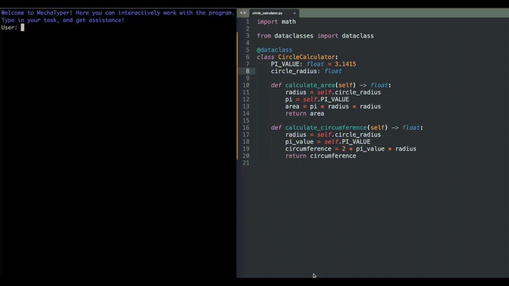

# MechaTyper


**MechaTyper** is a powerful and interactive tool designed to help programmers and developers extract information and refactor code within a project. It uses a combination of source code parsing and querying to effectively extract constructs such as functions, classes, and other elements, and allows the users to manipulate and apply changes to the source code files.

## Demo



## Word of Caution

:warning: MechaTyper is an experimental tool and utilizes a paid version of OpenAI for some of its features. Please be mindful of your usage as it may incur costs. Additionally, while MechaTyper aims to be helpful, it is not foolproof. We advise users to review the generated code and exercise caution. Use MechaTyper at your own risk. We are not responsible for any unintended consequences or damages that may arise from using this tool.

## Features

- **Code Parsing**: MechaTyper uses the `tree-sitter` library to parse source code files in various programming languages.
- **Query Language Constructs**: It allows querying for specific programming constructs, like functions, classes, etc., within the source code.
- **Batch Refactoring**: Allows batch refactoring across different files by applying changes to programming constructs.
- **CLI Interface**: Provides a command-line interface for interactive user experience.
- **Git Integration**: Capable of searching and identifying if the target directory is within a git repository.
- **Environment Configuration**: Supports loading environment variables from a `.env` file.
- **Colored Output**: Uses the `colored` crate for colorizing terminal outputs for enhanced readability.

## Installation

Before installing MechaTyper, ensure that you have Rust installed. You can install Rust from the [official website](https://www.rust-lang.org/tools/install).

Clone the repository:

```sh
git clone https://github.com/user/MechaTyper.git
cd MechaTyper
```

Build the project:

```sh
cargo build --release
```

## Usage

MechaTyper comes with a command-line interface. To run MechaTyper:

```sh
cargo run --release
```

Upon running, you will be greeted with a welcome screen. You can then interactively work with the program by typing in your task and getting assistance.

## Environment Configuration

Create a `.env` file in the root of the project directory with the following variables:

```
OPENAI_KEY=your_openai_key
```

Replace `your_openai_key` with your actual OpenAI key.

## Contributing

Contributions to MechaTyper are welcomed. Please ensure to follow the coding standards and create detailed pull requests.

## License

MechaTyper is licensed under the MIT License. See [LICENSE](LICENSE) for more information.